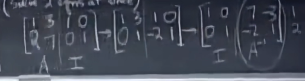

# 矩阵乘法

对于$AB=C$的理解方式:

- 对每个元素的计算方法（行乘列）

- C中每一列都是A中各列以B中对应列的方式进行线性组合

- C中每一行都是B中各行以A中对应行的方式进行线性组合
- A中每列*B中每行 可以得到最终矩阵的shape

所得矩阵：
$$
\begin{bmatrix}
2 & 12 \\
3 & 18 \\
4 & 24
\end{bmatrix}
$$
行空间和列空间都是一条直线

- 分块

# Singular matrix

- 如果其中一列对linear combination毫无贡献，那它不可能有逆

gauss-Jordan消元

每一次变换相当于乘了一次初等矩阵 乘到最后$A\rightarrow I, I\rightarrow A^{-1}$

