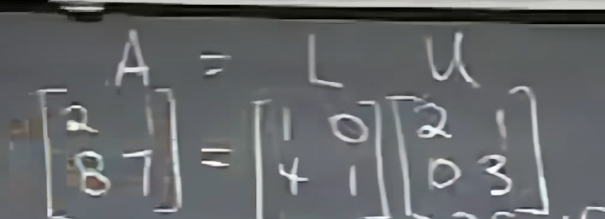
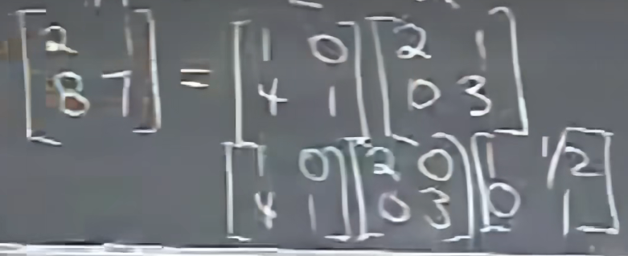

- 转置的逆=逆的转置

# LU分解

U:上三角

L:下三角

A = LU

A = LDU

- n*n矩阵，变换为U需要$n^3$次操作

$$
\sum_{i=1}^ni^2
$$

- LU分解简化了总的计算次数

# 置换矩阵

能让原矩阵行/列变化的矩阵
$$
\begin{bmatrix}
0 & 1 & 0 \\
1 & 0 & 0 \\
0 & 0 & 1 \\
\end{bmatrix}
$$

$$
A^{-1}=A^T=A
$$
