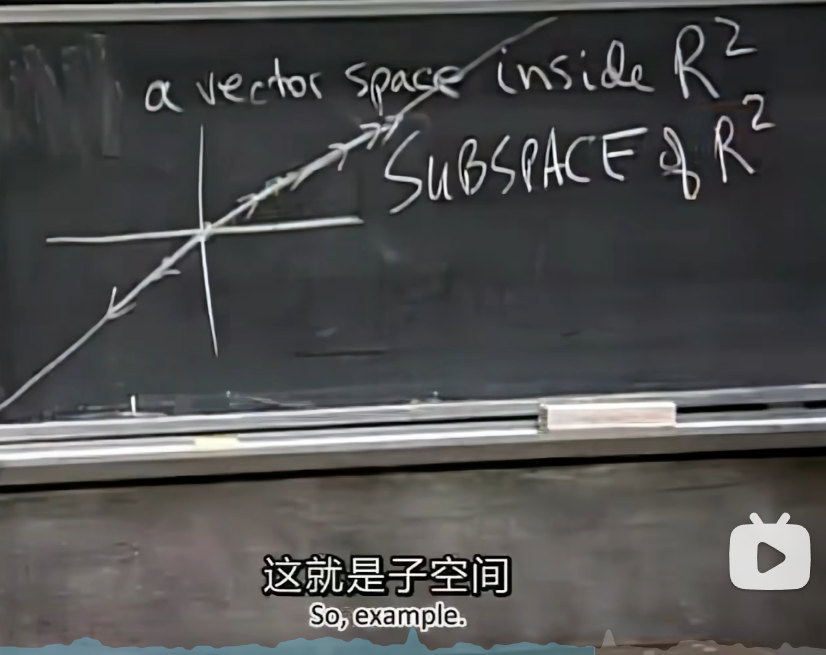
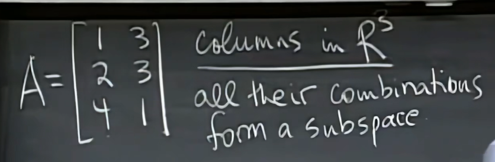

# Permutation

$A^TA$ is a symmetric matrix.

Prove:$(A^TA)^T=A^TA$

# Vector space

- linear combination

- 对线性组合封闭（相加、数乘）

# Subspace

- subspaces of $R^2$
  - all of $R^2$
  - any line through[0, 0]
  - $Z$(零向量)

各列的线性组合组成了$R^3$的子空间

- column space $C(A)$

