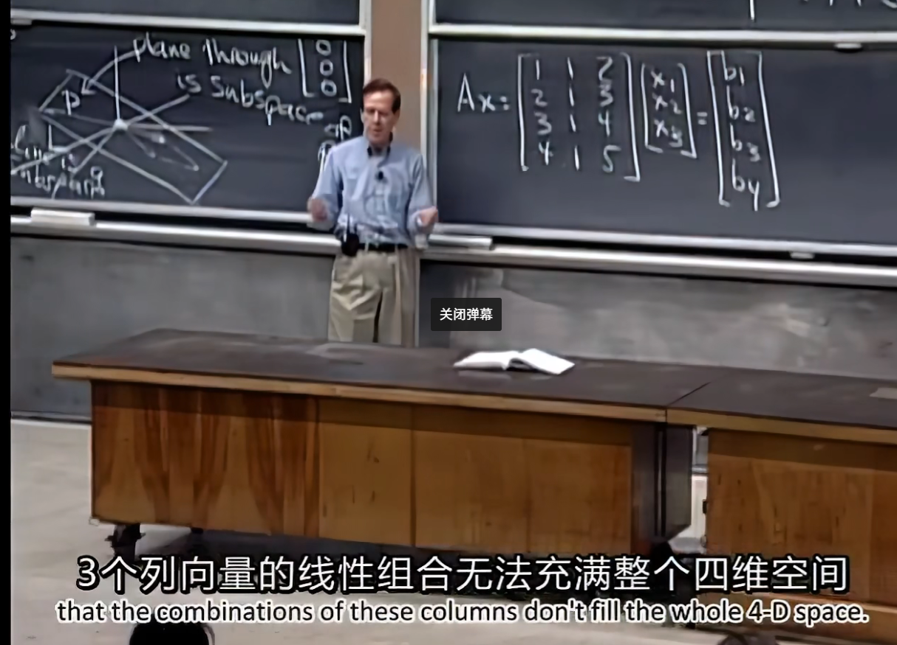

# Subspace

Assume 2 subspaces:P & L, which P is a plane and L is a line.
$$
P \cup L \text{ is maybe a subspace.(condition:}P \cup L = P\text{)}\\

P \cap L \text{ is a subspace.}
$$
豁然开朗！

A是四维的，其只有三列，张成子空间肯定无法布满四维空间，x看作是线性组合的方式，所以总会存在b使方程组无解

- We can solve $Ax=b$ when b in $C(A)$.
- null space $N(A)$, $x$ that makes $Ax=0$
