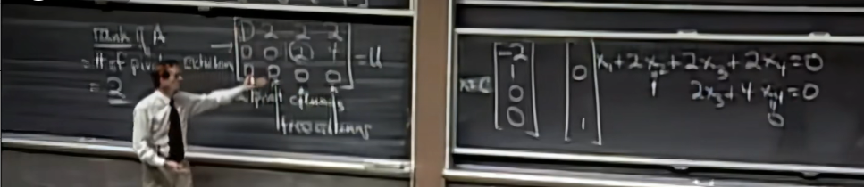
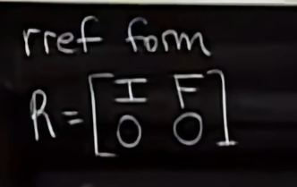

# Rank

- number of pivots(主元)

非主元所在列即为自由变量

自由变量可取任意值（no contributions）

special solution:自由变量取0和1时的解，一个自由变量对应一个特解

m*n矩阵，其秩r，自由变量个数n - r r即为主元个数

I:单位矩阵(r*r)

F:A的reduced行阶梯型矩阵中自由变量列的矩阵(r*(n-r))
$$
N(A) = \begin{bmatrix}
-F \\
I
\end{bmatrix}
$$
此即$Ax=0$的解空间