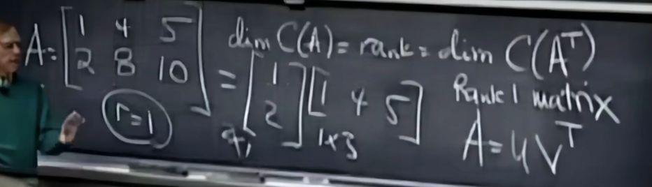
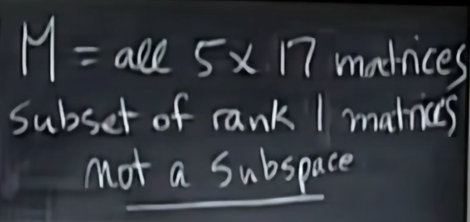
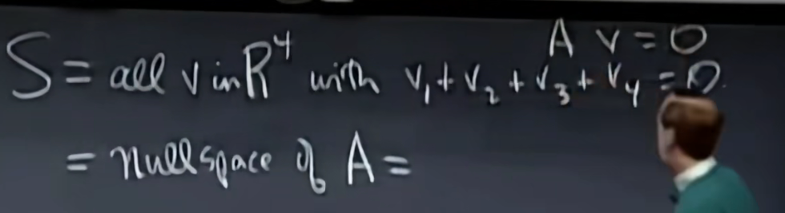

# 矩阵空间

基：矩阵内元素个数

3*3->9

对称矩阵(S)、上三角矩阵(U)的基是6

S$\cap$U的基是3-->对角矩阵

S+U的基是9-->all 3*3

# 秩1矩阵

- 可以分解为1列*1行的形式

- 两个秩1矩阵相加无法构成子空间 一是没有0向量 二是相加之后秩可能为2

- 由集合S组成的向量v维度是3

过程：假设v是某个矩阵的零空间，求出该矩阵A
$$
A = \begin{bmatrix}
1 & 1 & 1 & 1
\end{bmatrix}
$$
该矩阵n=4，r=1，零空间维度4-1=3