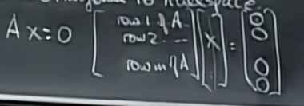
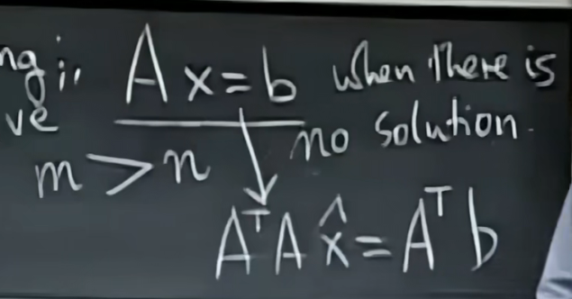
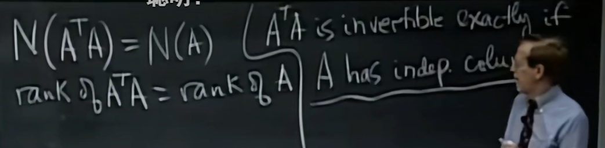

# 正交向量

$x^Ty=y^Tx=0$,x和y是列向量 

## 子空间S和T的正交关系

- 含义：S中的每个向量都和T中的每个向量正交
- 如果两个平面相交，那么它们一定不正交

！！！正交不等于垂直，比垂直严格很多

这个等式告诉我们x与行空间正交，即零空间与行空间正交

同理，左零空间和列空间正交

- 零空间包含了所有垂直于行空间的向量

# “解”一个无解方程

方程左右两边同左乘$A^T$即可，对于部分A左部可转为可逆

$A^TA$是可逆的当且仅当A的各列线性无关

