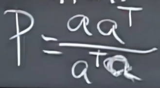
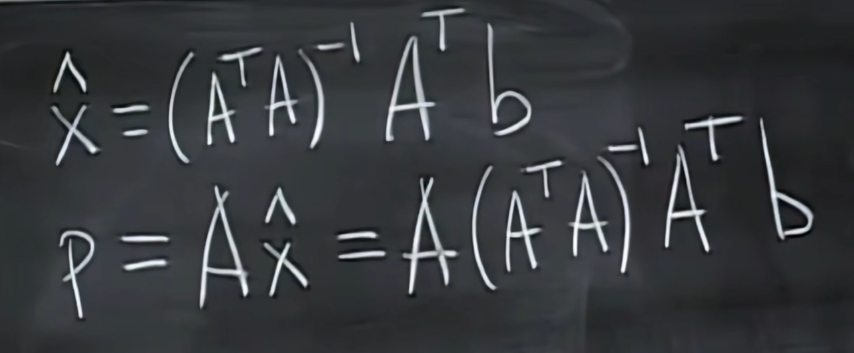

# 子空间投影

- a和b：两个向量
- P：投影矩阵
- p=xa，x是一常数
- p=Pb

# P

- 分母是个数 分子是n*n矩阵，n是A的维数
- 秩是1
- 其列空间是一条穿过a的线（因为P只由a组成）
- 对称矩阵，$P^T=P$
- 投影多次结果不变，说明$P^n=P$

# 为什么要投影？

- 解决$Ax=b$无解的问题
- 转换为$A\hat{x}=p$的问题，p是b在列空间上的投影

- 假设A组成要投影的空间，b是被投影的向量，p是b投影到该空间后的向量，x是任意值（与A线性组合），这里要求出投影在空间上的哪个地儿

$$
A^T(b-A\hat{x}) = 0
$$

- $b-A\hat{x}$是A的左零空间，与A的列空间垂直，验证了误差垂直于被投影空间的结论

$$
P = A(A^TA)^{-1}A^T
$$

- 不能把逆拆开，因为A不是方阵
- 如果A是满秩仿真，说明A的列空间布满所有维度，$P=I$，$Ax=b$无论何种情况都有解
- $P^T=P,P^2=P$