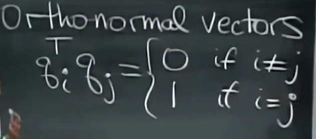
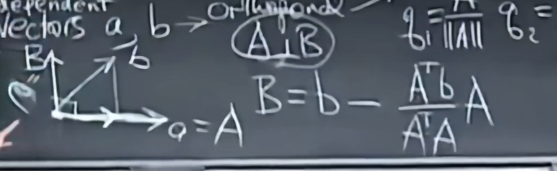
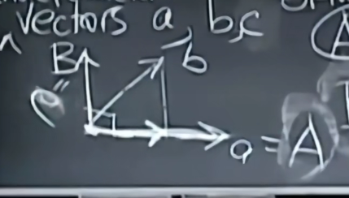

# 符号规定

q表示正交向量

一组标准正交基组成标准正交矩阵Q
$$
Q^TQ=I
$$
如果Q是方阵，那么$Q^T=Q^{-1}$

- 其标准正交空间的投影矩阵为I

$$
P=Q(Q^TQ)^{-1}Q^T=QQ^T=I \text{		if Q is square}
$$

- 第一步：归一化，使模长为1
- 第二步：正交化

$$
B = b - \frac{A^Tb}{A^TA}A \\
C = c - \frac{A^Tc}{A^TA}A - \frac{B^Tc}{B^TB}B \\
...
$$

- 正交化前后向量张成的列空间完全一样

# QR分解

将原矩阵分解成与其列空间相同的标准正交矩阵Q和上三角矩阵R$A=QR$

- R右乘是因为A与Q列空间保持相同

R是上三角矩阵而不是对角矩阵
$$
R=Q^TA = \begin{bmatrix}
q_1^Ta_1 & q_1^Ta_2 \\
q_2^Ta_1 & q_2^Ta_2
\end{bmatrix}
$$
当Q的行下标大于A的列下标时才会为0