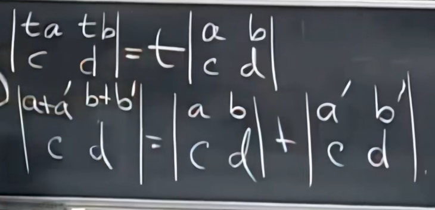
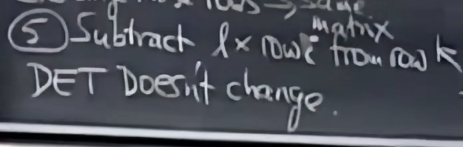
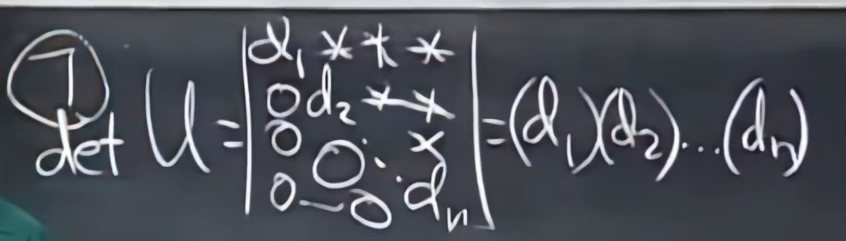

# 行列式

$$
det A = |A|
$$

性质：

- $\det\ I = 1$
- 交换行/列行列式的值取反

- 行列式不具有线性性，行列式的每一行具有线性性
- 两行相等的矩阵行列式为0

 、

- 有一行是0那么该矩阵的行列式为0

- A是奇异矩阵时$\det\ A=0$

- $\det\ AB = (\det\ A)(\det\ B)$
- $\det\ A^T=\det\ A$

