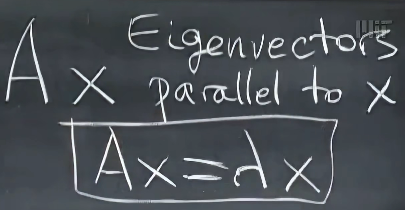
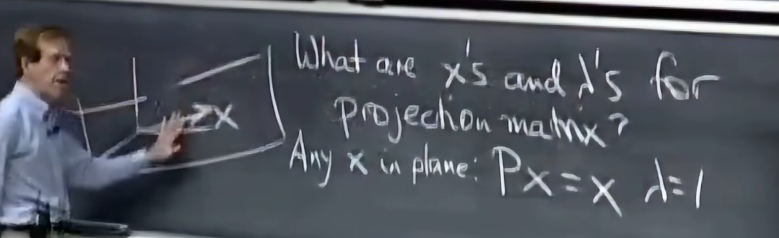
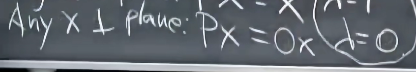
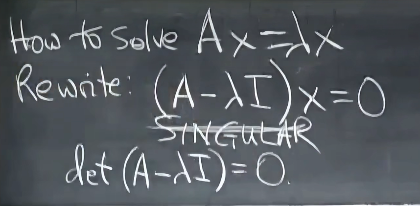
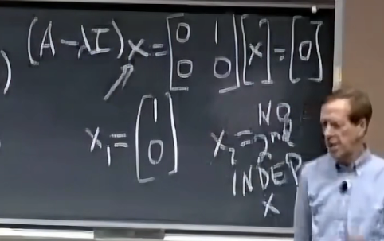

# 特征值、特征向量

- eigenvalue、eigenvector

- 以投影为例
- 当被投影向量$b$在投影平面上时为特征向量，$\lambda$=1，$A=P$

- 正交于投影空间，$\lambda$=0，$A=P$

迹：对角线元素和=特征值的和

## 求解特征值

## 分析特征值与特征向量的改变

$$
\begin{bmatrix}
0 & 1 \\
1 & 0
\end{bmatrix}\rightarrow
\begin{bmatrix}
3 & 1 \\
1 & 3
\end{bmatrix}
$$

加了$3I$后，特征值+3，特征向量不变

- 三角矩阵的特征值都在对角线上

重复特征值的情况

