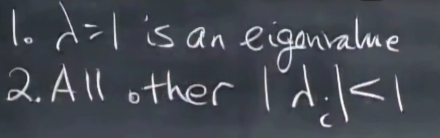
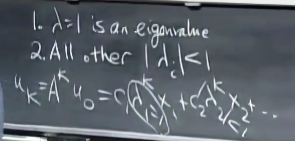
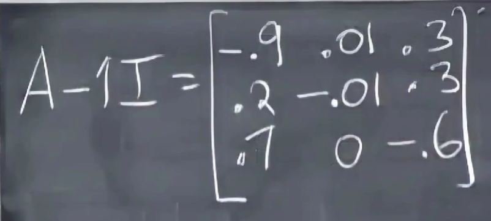
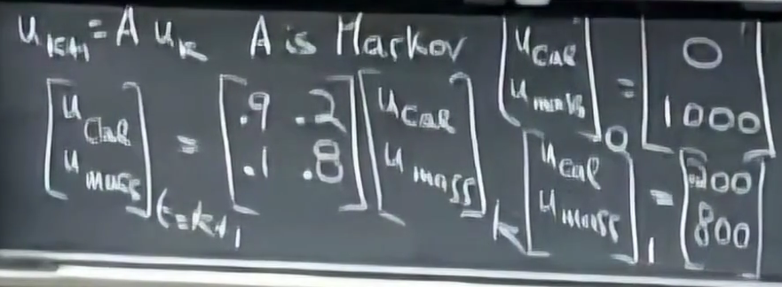
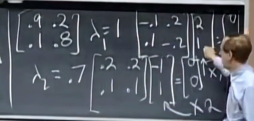
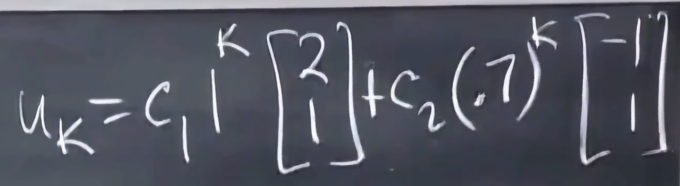
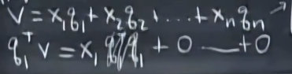

# 马尔可夫矩阵

- 每列相加和为1

- 稳态与$\lambda = 1$时有关

# 证明存在$\lambda = 1$

只要这个矩阵含有特征值0，原矩阵就有特征值1        

- 奇异矩阵，得证

# 使用马尔可夫矩阵求解问题

- 参见矩阵的幂，求解将某向量经过数次相同变换后的向量

# 傅里叶级数

## 标准正交基的投影问题

## 傅里叶级数

$$
f(x) = a_0 + a_1\cos x + b_1\sin x + a_2\cos{2x} + b_2\sin{2x} + \dots
$$

- 函数的点积：这些不同函数间点积都是0

$$
f^Tg=\int_0^{2\pi} f(x)g(x)dx
$$

- 因此$a_0$的值是$f$的平均值，$a_1=\frac{1}{\pi}\int_0^{2\pi}f(x)\cos x dx$，因为$\int_0^{2\pi}\cos^2 x = \pi$，前面要除以系数$\pi$