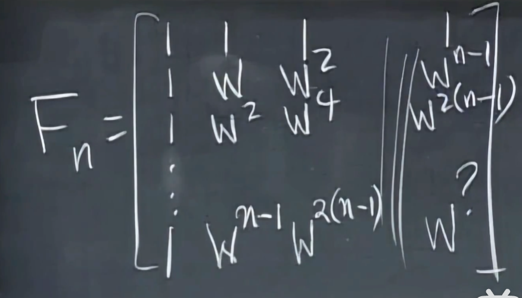

# 复数矩阵

模长定义：$\bar{z}^Tz=|z|^2$

其中$\bar{z}$是$z$的共轭

$\bar{z}^T=z^H$

## 埃尔米特矩阵

- 类比实数域中的对称矩阵
- $A^H=A$

## 复数域中的标准正交基

$$
q^H_iq_j = \left\{\begin{matrix}
	0,\ i \neq j \\
	1,\ i = j
\end{matrix}\right.
$$

# 酉矩阵

- 对应实数域中的正交矩阵
- $Q^HQ=I$

# 傅里叶矩阵

当w=i时，矩阵为

- 可用于傅里叶变换/逆变换
- 正交矩阵，注意这里内积要取共轭
- 其逆等于共轭转置

$F_{64}$与$F_{32}$的关系

P是一个转置矩阵，将所有偶数列(0,2,4,...)置于奇数列前

D是一个对角矩阵

- 递归