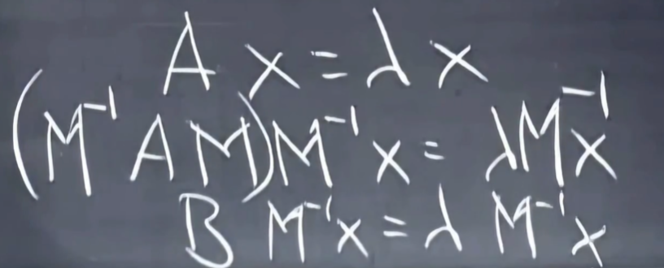

# 相似矩阵

A和B是相似的，即对于一些M，有$B=M^{-1}AM$

- 和对角化$S^{-1}AS=\Lambda$有些相似
- 相似矩阵的特征值相同

证明

# 若尔当型

- 在存在重根的情况下，A无法被对角化（因为对角化后的该部分无论乘啥还是单位矩阵乘常数），但是可以和若尔当型相似
- 若尔当块：对角线上方的数为0/1且该数左方和下方的数要相同
- 当矩阵若尔当块完全相同时两个矩阵才相似
- 每个方阵A都相似于若尔当阵J
- 若尔当块数量=特征向量的数量