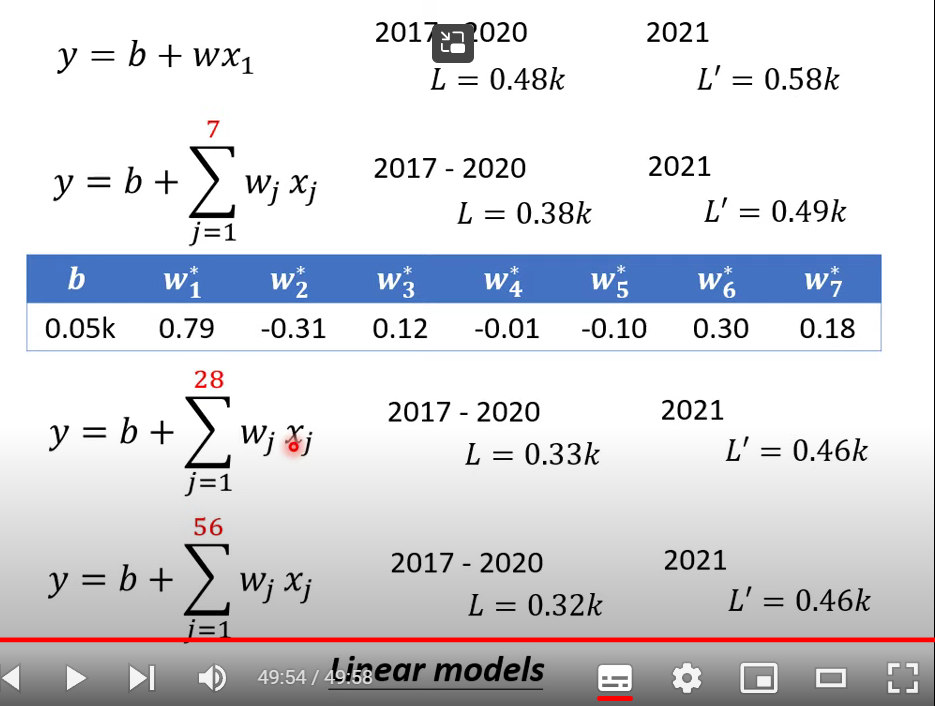

# 机器学习概念

- 让机器具备寻找函数的能力

# 不同的函数类别

- 回归：输入是数据输出是scalar
- 分类：给定类别，函数选择正确的一个
- 结构化学习：创造有结构的东西，比如图像和文档

# 损失函数

$L(b,w)$输入weight和bias

对于$L=\frac{1}{N}\sum_ne_n$:

- MAE:$e=|y-\hat y|$
- MSE:$e=(y-\hat y)^2$

如果$y$和$\hat y$都是概率分布——交叉熵

# Optimization

计算梯度后w移动$\eta \frac{\delta L}{\delta w}$,$\eta$是学习率

$w^1\leftarrow w^0-\eta \frac{\delta L}{\delta w}|_{w=w^0}$

- 局部最小值和全局最小值
- local minima是个假问题

# 训练的过程

- 未知的函数
- 定义loss
- optimization

